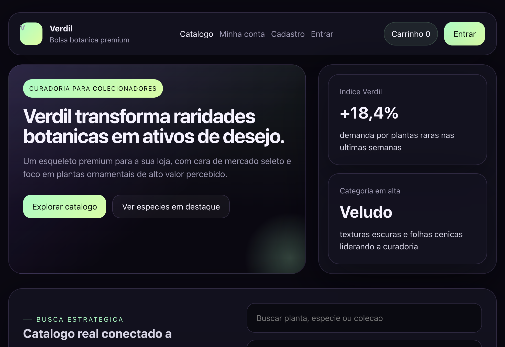
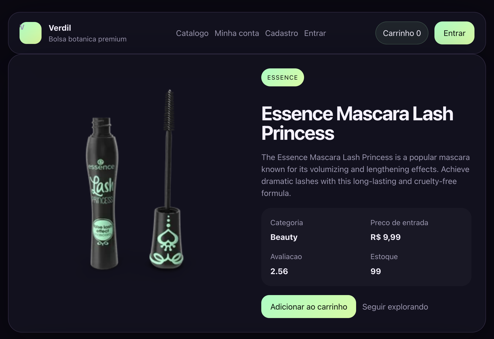
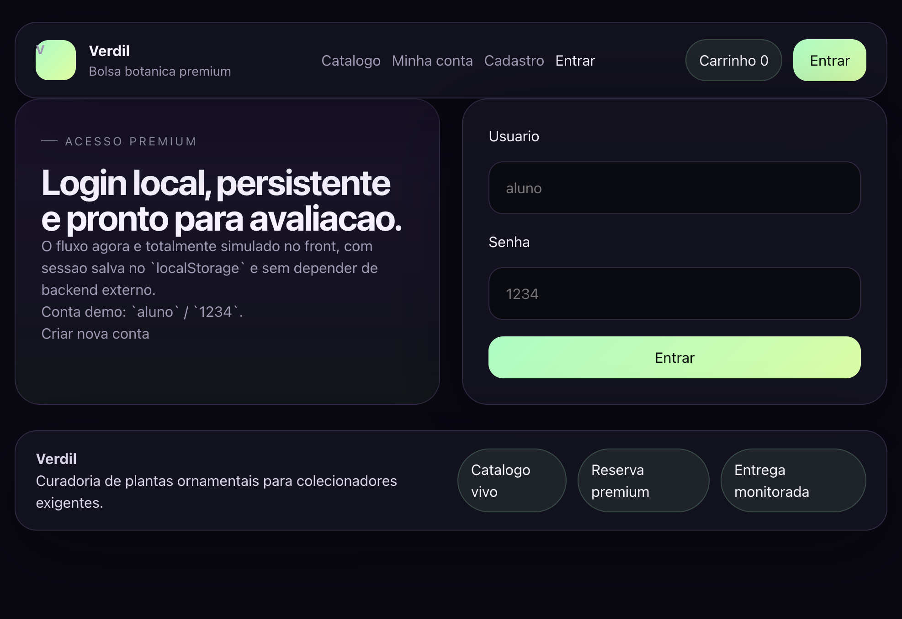
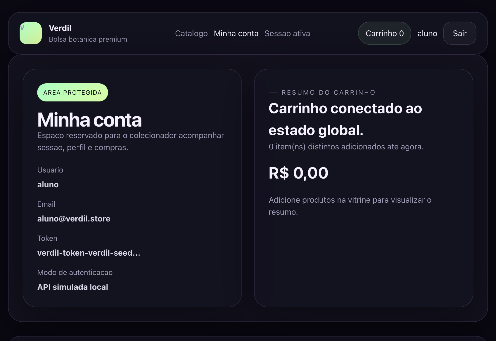

# Verdil

Loja SPA (React + Vite) com identidade escura premium e proposta de “bolsa botanica”: um catalogo para plantas ornamentais (curadoria para colecionadores), com vitrine, detalhe, autenticacao e rota protegida.

## Como rodar

```bash
npm install
npm run dev
```

## Credenciais de teste

- Usuario: `aluno`
- Senha: `1234`

Tambem e possivel criar uma nova conta na rota `/cadastro` (cadastro local salvo no navegador).

## Rotas

- `/` — catalogo (lista de produtos, busca e filtro por categoria)
- `/produto/:id` — detalhe do produto
- `/login` — login
- `/cadastro` — cadastro (simulacao local)
- `/minha-conta` — area protegida (redireciona para `/login` se nao estiver autenticado)
- `*` — pagina 404

## Funcionalidades implementadas

- Componentizacao (reutilizaveis)
  - `Layout` com `children`/`Outlet`, `Cabecalho`, `Rodape`, `Vitrine`, `ProdutoCard`, `Botao`, `Selo`
  - Renderizacao condicional e listas com `.map()`
- Estado, hooks e API
  - Consumo de produtos via DummyJSON
  - Estados de carregamento e erro
  - Busca por texto e filtro por categoria
- Navegacao SPA
  - React Router com lista, detalhe por `:id` e pagina 404
  - Clique no produto abre detalhe
- Autenticacao (simulada no front)
  - Login e cadastro com “API fake” (persistencia em `localStorage`)
  - Sessao em Context
  - Rota protegida e logout
- Bonus
  - Carrinho basico em Context (contagem no header, resumo na area protegida e funcionalidade de remover)
  - Identidade visual refinada com tema escuro, tipografia e iconografia (SVG) proprios.

## Entrega do Projeto

Para enviar o trabalho como `.zip` excluindo a pasta `node_modules`, voce pode rodar no terminal (macOS/Linux):
```bash
zip -r neostore.zip . -x "node_modules/*" -x ".git/*"
```

### Deploy (Bônus)

Se quiser ganhar os pontos de Deploy, voce pode publicar facilmente na Vercel:
1. Crie uma conta em [vercel.com](https://vercel.com)
2. Instale a CLI: `npm i -g vercel`
3. Rode `vercel` na raiz do projeto e siga os passos padrao.

## Prints

Os prints ficam na pasta [screenshots](./screenshots).

### Catalogo



### Detalhe



### Login



### Area protegida


